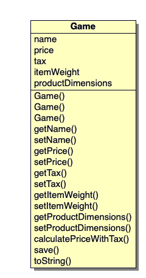
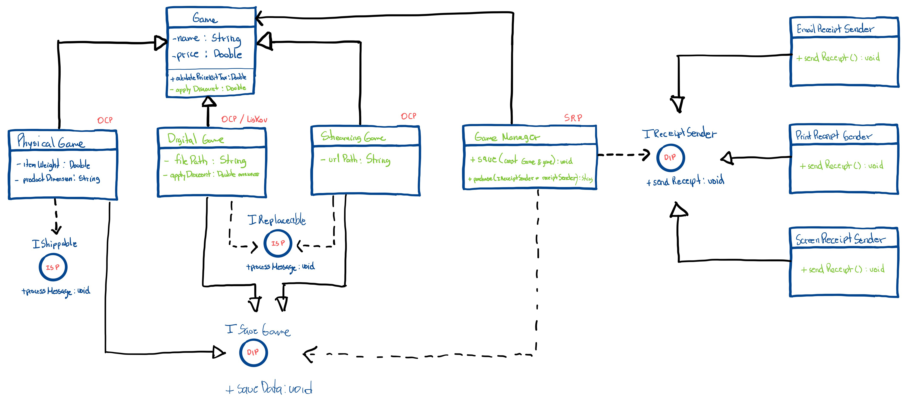
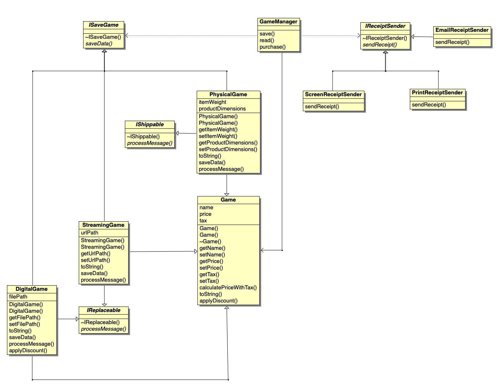

# Lab04 - SOLID - SOLUTION

The following laboratory is about trying to applying the rules of design SOLID principles to this example.

- **S**ingle responsibility 
- **O**pen-closed
- **L**iskov substitution
- **I**nterface segregation
- **D**ependency inversion

**Context:**

- A company that sells physical video games, with the DVD and the corresponding box.

- They want to update the app with new requirements:

- - There will be physical, digital, and streaming games.
  - All digital games will have a discount of 15%, but physical games no discount for now.
  - All physical games will have a process to ship the product. This process will be a method with the return text "this product will have a shipment."
  - All digital and streaming games will have a process to replace the product. This process will be a method with the return text "this product will have a replacement."
  - *** optional *** just create the name of the process and the corresponding definition without implementation.
    - Send a receipt, namely, printing and sending via mail, sending via email, or showing the receipt in the user account page on the platform.
    - For the latter, we send a notification to the user via email or the app that the receipt is ready to be viewed.

**What do you need to do?**

- You will need to generate a UML.
- You will need to refactor the source code with a better approach to incorporate different design rules.

# Solution

There are different ways to solve this problem, however this solution cover all the requirements.

## Initial UML

## UML draft solution

- Single responsibility **(SRP)**
- Open-closed **(OCP)**
- Liskov substitution **(Liskov)**
- Interface segregation **(ISP)**
- Dependency inversion **(DIP)**

## UML Final

